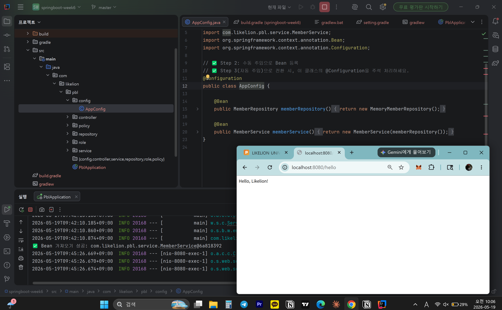
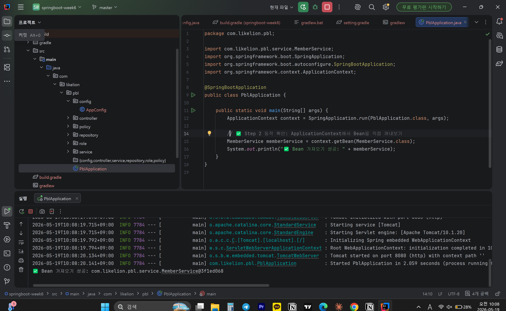
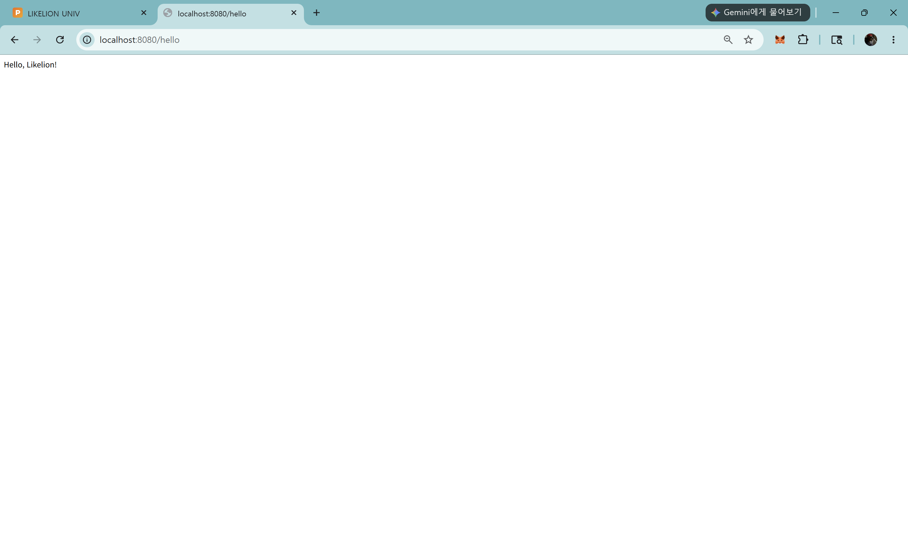

# 📘 Today I Learned

### 1. 오늘 배운 내용
직접 new로 객체를 생성하고 조립했던 코드가, Spring Boot에서 대체되는 방법
스프링 컨테이너와 Bean을 관리하는 방법
수동 주입(@Configuration + @Bean)과 자동 주입(@Component, @Service, @Repository)의 차이
생성자 주입 방식과 @Autowired의 역할
생성자가 1개일 때 @Autowired를 생략할 수 있는 이유
@RestController와 @GetMapping을 사용해 HTTP 요청을 처리하는 방법

### 2. 핵심 정리 (내 언어로)
- new로 직접 만들던 객체를 스프링 컨테이너가 대신 만들고 관리해줌. 이 객체들을 Bean이라고 부름.
- ApplicationContext = 스프링 컨테이너. Bean을 보관하고 관리하는 창고
  Bean = 스프링 컨테이너가 관리하는 객체
- 수동 주입은 객체 생성과 조립을 직접하고 자동 주입은 객체 생성과 조립을 스프링이 알아서한다
- Bean을 등록했으면 필요한 곳에 주입해야 함.가장 권장되는 게 생성자 주입.
- @Autowired = "스프링아, 이 타입에 맞는 Bean을 컨테이너에서 찾아서 넣어줘" 
- 스프링이 생성자가 1개뿐이면 당연히 그걸로 주입하겠다고 자동으로 판단함. 그래서 생성자가 1개이면 생략 가능
- @RestController = @Controller + @ResponseBody. 반환값을 JSON/문자열로 바로 응답
  @GetMapping("/hello") = GET 방식으로 /hello 경로 요청을 이 메서드에 매핑
### 3. 결과 이미지(스크린샷)
- 
- 
- 
### 4. 느낀 점
- 객체를 직접 만들고 연결하는 것에서 스프링 컨테이너가 그걸 대신하는 흐름을 이해하면서 스프링 사용의 이점을 느낄 수 있었다.
- 각 개념들을 좀 더 깊이 이해하고 실제 프레임 워크에서 어떻게 동작하는지 체감할 수 있었다.