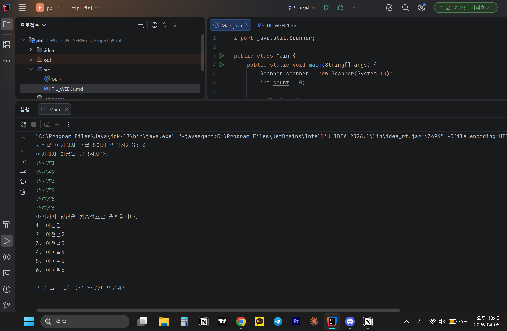

# 📘 Today I Learned

### 1. 오늘 배운 내용
- scanner
- 배열
- while문
- for문
- java의 자료형
### 2. 핵심 정리 (내 언어로)
- Scanner scanner = new Scanner(System.in)으로 입력을 받는 객체를 생성할 수 있음
- nextInt()는 정수만 읽고 \n는 버퍼에 남김. nextLine()은 한 줄 전체를 읽음.
- 그래서 nextInt()직후에 nextLine()을 한 번 호출해주어야함.
- 배열은 크기가 고정되고 한 번 정하면 변경할 수 없음.인덱스는 0부터
- while문 true로 무한루프 만들고 break로 탈출하기.(올바른 값이 들어올 때까지 반복할 때 자주 사용)
- 1++,++1가 서로 다름
### 3. 결과 이미지(스크린샷)

### 4. 느낀 점
- 파이썬과는 다른 자바만의 표현 방식과 특징들에 익숙해져야할 듯 함.
- 기본적인 원리는 같은데 자바에서 명시적으로 표현해줘야 하는 게 더 많아서 상대적으로 복잡하게 느껴졌음.
- 코드를 직접 구현하면서 개념을 익히는 것이 이해하는 데는 훨씬 효과적인 것 같음.