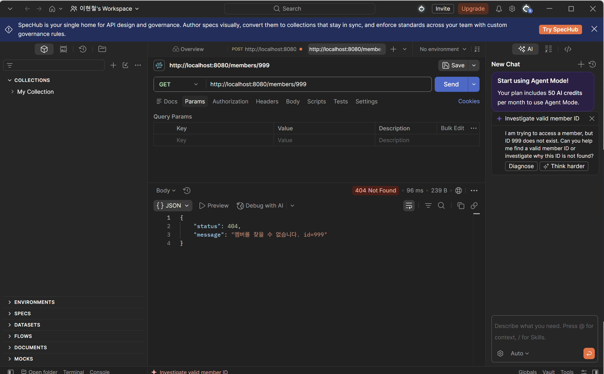
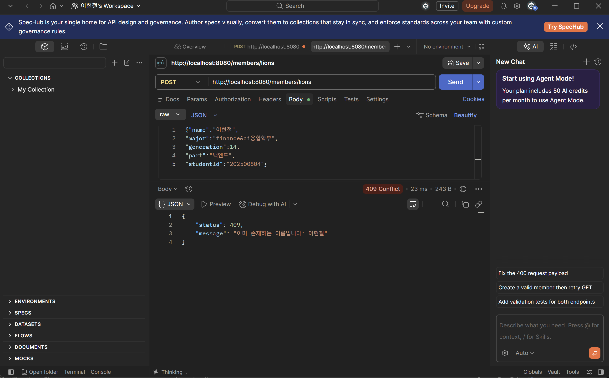
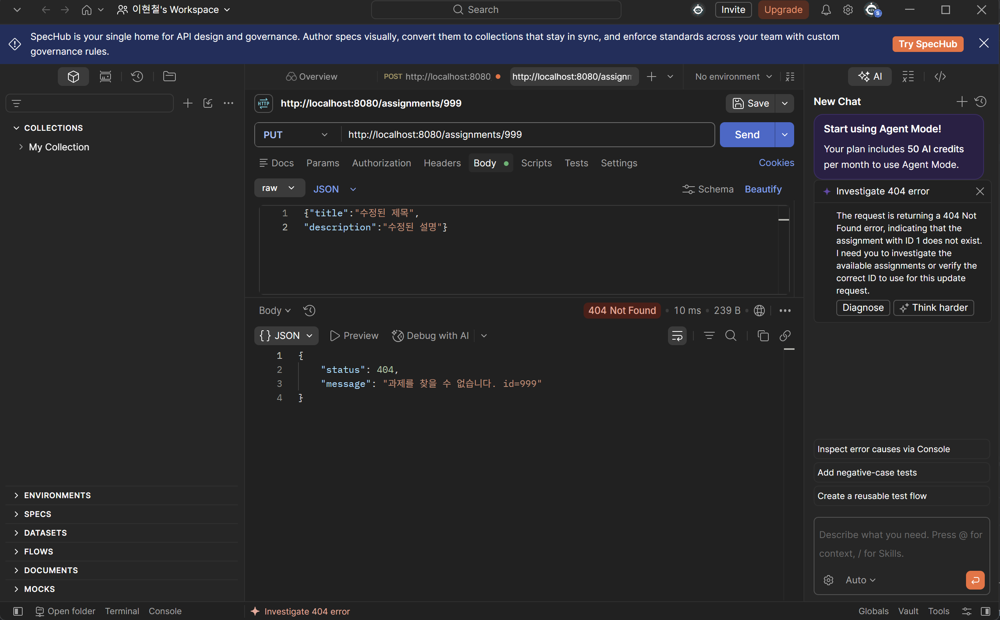
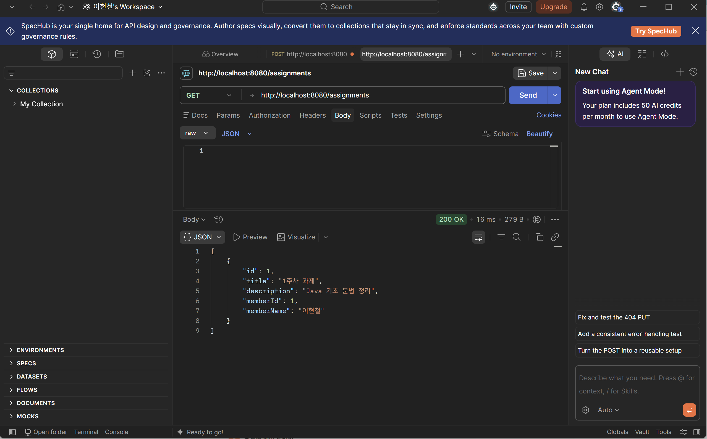
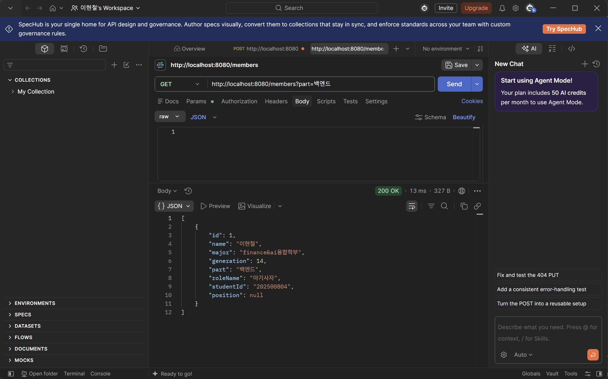
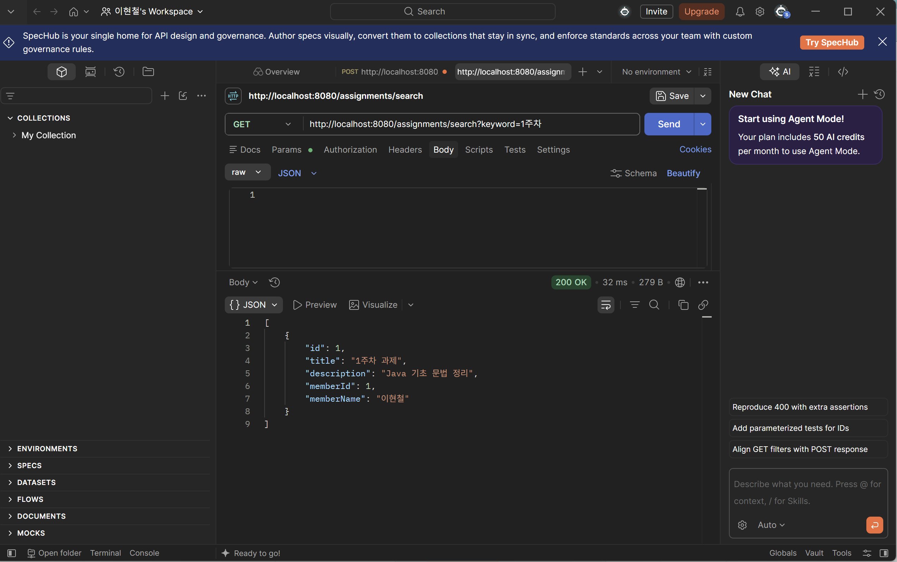

# 📘 Today I Learned

### 1. 오늘 배운 내용
- `@RestControllerAdvice`로 전역 예외 처리기를 만들고, `@ExceptionHandler`로 특정 예외를 잡아 일관된 에러 응답(`ErrorResponse`)을 반환하는 방법
- 비즈니스 상황별 커스텀 예외(`MemberNotFoundException`, `AssignmentNotFoundException`, `DuplicateMemberNameException`)를 만들어 던지는 방법
- Service에서 `null` 대신 예외를 던지도록 리팩토링하고, Controller의 null 체크를 제거하는 흐름
- Spring Data JPA 쿼리 메서드 네이밍 규칙(`findByPart`, `findByTitleContaining`)으로 검색 기능 구현
- 프론트엔드 `fetch()` → JSON 응답 → 화면 렌더링까지 이어지는 통신 흐름을 HTTP 로그로 추적

### 2. 핵심 정리 

**@RestControllerAdvice란?**
모든 `@RestController`에 공통으로 적용되는 예외 처리기를 한 클래스에 모아두는 어노테이션. Controller마다 try-catch를 반복하지 않아도 되고, 에러 응답 형식이 API 전체에서 통일된다.

**@ExceptionHandler의 동작 원리**
컨트롤러(혹은 서비스)에서 예외가 던져지면, Spring이 그 예외 타입과 일치하는 `@ExceptionHandler(예외타입.class)` 메서드를 찾아 대신 실행시켜준다. 즉 "이 타입의 예외가 발생하면 이 메서드로 처리해줘"라는 매핑 테이블을 등록하는 것과 같다. 예외가 컨트롤러 밖으로 던져지는 순간 Spring MVC가 가로채서 매칭되는 핸들러로 라우팅한다.

**커스텀 예외를 만드는 이유**
`RuntimeException`을 그냥 쓰면 "무슨 상황에서 왜 실패했는지"를 타입만으로 구분할 수 없다. `MemberNotFoundException`처럼 상황별로 예외 타입을 나누면, `@ExceptionHandler`가 타입 기준으로 서로 다른 상태 코드(404 vs 409)를 매핑할 수 있고, 코드를 읽는 사람도 어떤 실패인지 바로 파악할 수 있다.

**null 반환 vs 예외 던지기**
null을 반환하면 호출부(Controller)가 매번 `if (result == null)` 체크를 해야 하고, 체크를 깜빡하면 `NullPointerException`으로 원인 불명의 장애가 난다. 예외를 던지면 실패 상황이 명시적으로 드러나고, 처리를 깜빡해도 전역 핸들러가 안전망 역할을 하며, Controller 코드는 정상 흐름만 담당하면 된다.

### 3. 결과 이미지

### 4. 느낀 점
- 예외 처리를 한곳에 모아두니 Controller가 훨씬 얇아지고, "정상 흐름만 담당한다"는 책임 분리가 실제로 체감됐다.
- JPA 메서드 이름 규칙이 처음엔 마법처럼 느껴졌는데, 규칙만 알면 오히려 SQL보다 빠르고 실수도 적다는 걸 알았다.
- 프론트-백엔드 통신을 로그로 직접 따라가 보니 "어디서 뭐가 오가는지" 막연했던 부분이 명확해졌다.
