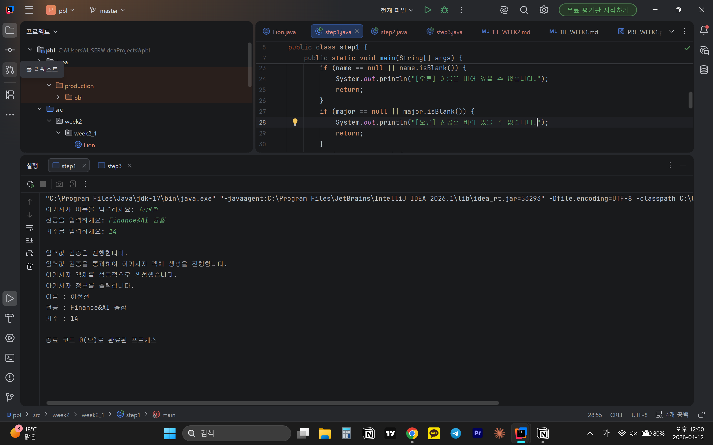
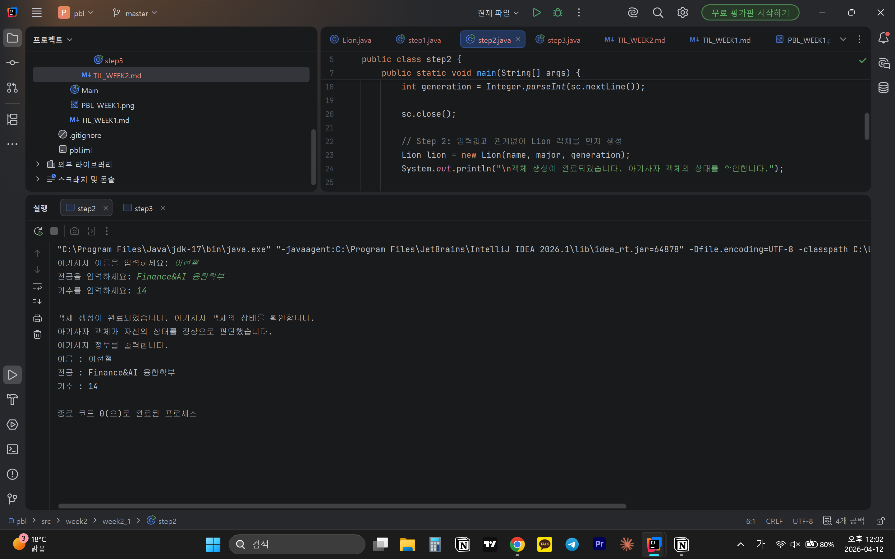
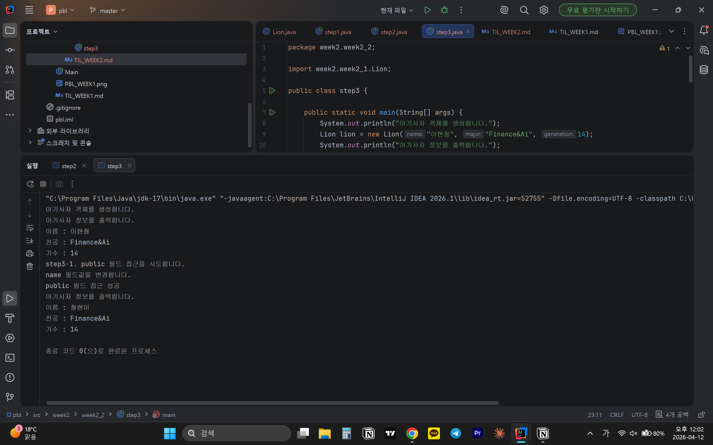
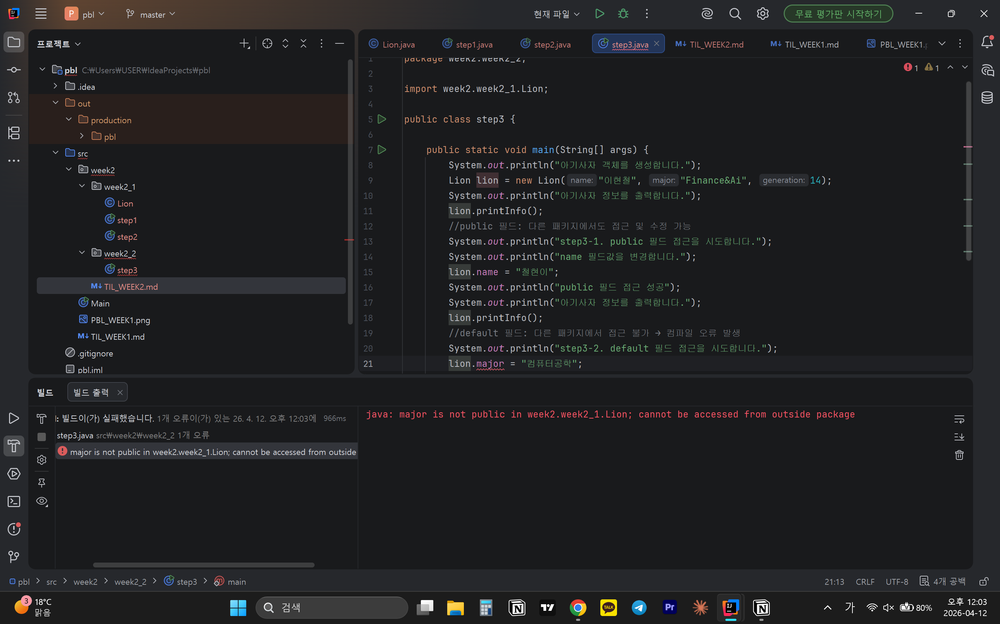
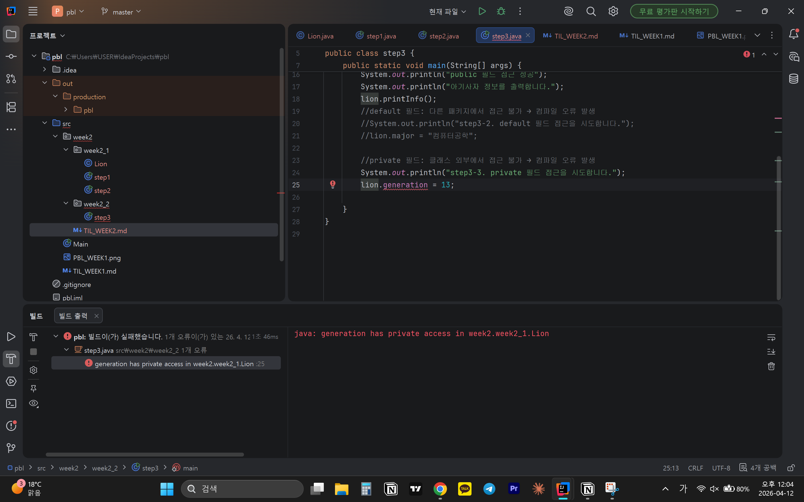

# 📘 Today I Learned

### 1. 오늘 배운 내용
- 객체 지향 프로그래밍
- 클래스의 역할과 책임,캡슐화
- main 메서드와 객체의 도메인 메서드의 역할과 책임
- 접근 제어자를 객체 내부 데이터 보호 방식

### 2. 핵심 정리 (내 언어로)
- main에서 검증을 진행하는 경우 조건이 바뀌면 main을 바꿔야한다. Lion이 늘어나면 그만큼 main이 복잡해진다.

    Lion에서 검증을 진행하는 경우 조건이 바뀌면 Lion만 수정하면 된다.main은 isVaild() 결과 받아서 흐름을 제어함.
- public -> 다른 패키지에서도 접근 수정 가능  
    default -> 다른 패키지에서 접근 불가  
    private -> 클래스 외부에서 접근 불가  
  객체의 상태를 외부에서 함부로 바꾸지 못하도록 보호하는 것
### 3. 결과 이미지(스크린샷)
- 
- 
- 
- 
- 
### 4. 느낀 점
- 객체가 생성된 이후 외부에서 필드 값을 변경하려고 시도할 때 접근 제어자에 따라 접근 가능한 범위가 어떻게 달라지는지 잘 이해할 수 있었다.
- 항상 느끼는 거지만 이런 것들을 어떤 상황에서 이런 것들을 활용해야하는 지는 추가적인 공부가 필요할 것 같다.