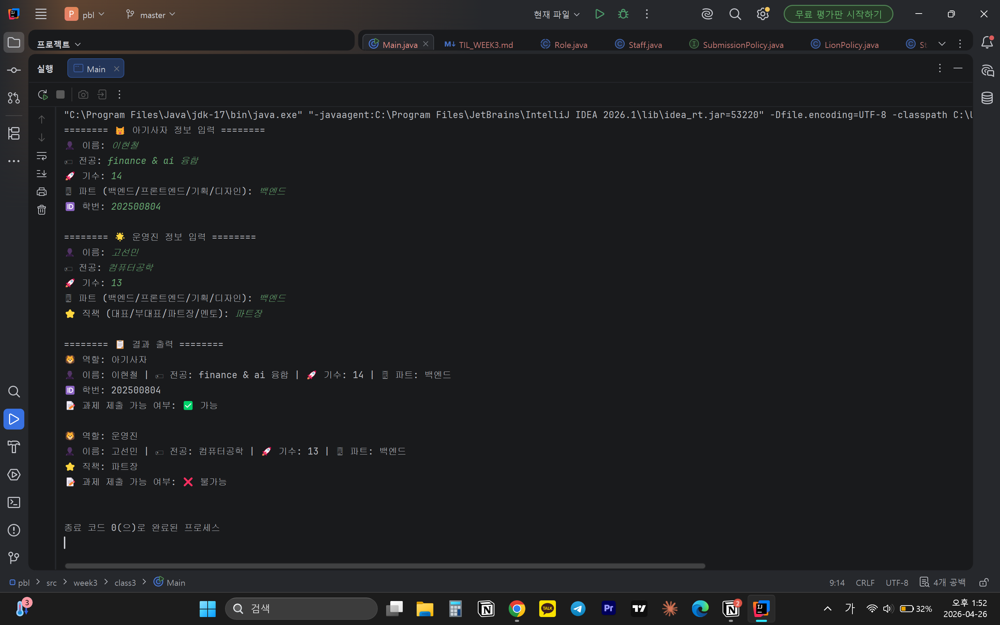

# 📘 Today I Learned

### 1. 오늘 배운 내용
- 공통되는 정체성을 추상 클래스나 상속 구조로 묶기
- 역할별로 달라지는 기준은 인터페이스로 추상화
- 실행할 때는 다형성에 의해 역할에 맞는 동작이 선택됨
- #### 역할을 가진 객체에게 판단을 맡기는 구조를 설계

### 2. 핵심 정리 (내 언어로)
- 추상 클래스: 공통 필드를 한 곳에서 관리 -> Lion이든 Staff이든 공통적으로 필요한 정보를 각자 클래스에 중복으로 쓰는 대신 부모클래스에 한번에 정의
- 인터페이스: Main에서 if-else문을 활용할 수 있지만 역할이 바뀌면 계속 수정해줘야하는 비효율이 생김-> 정책을 별도로 분리하고 각자 자신에게 맞는 정책 객체를 갖도록 함
- 다형성: 같은 타입 변수에 다른 객체를 담을 수 있음. 어떤 메서드가 실행될지는 런타임에 결정. 새 타입을 추가해도 기존 코드 수정 안 해도 됨.
### 3. 결과 이미지(스크린샷)

### 4. 느낀 점
- if-else문으로 간단하게 구현할 수 있는 문제를 추상 클래스, 인터페이스, 다형성를 활용하여 해결하는 이유는 변경사항이 생겼을 때 수정할 것을 줄이고 효율을 높이기 위한 것임음 깨달음
