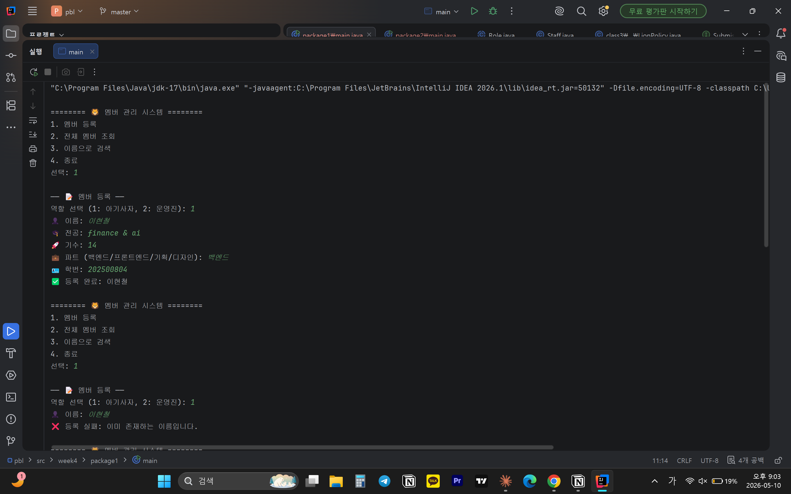
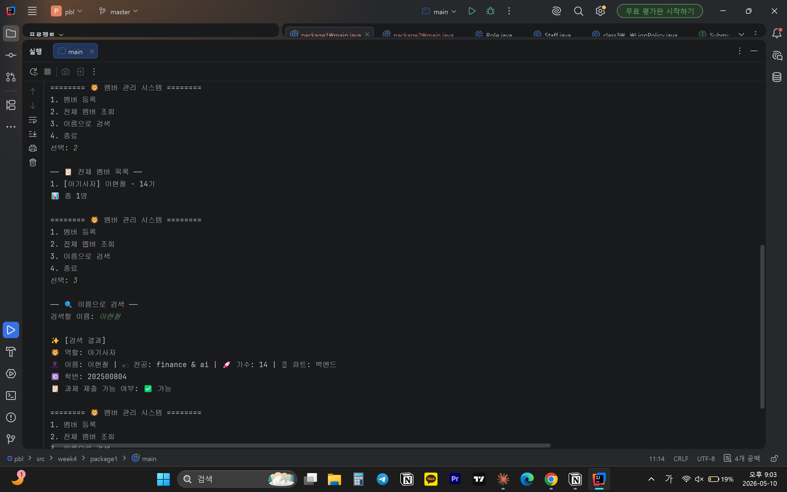
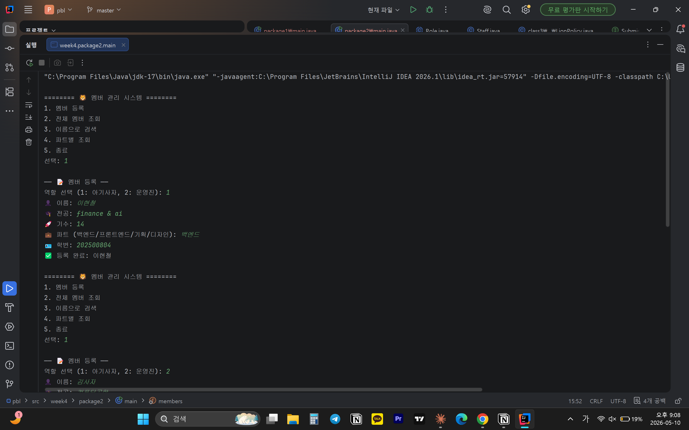
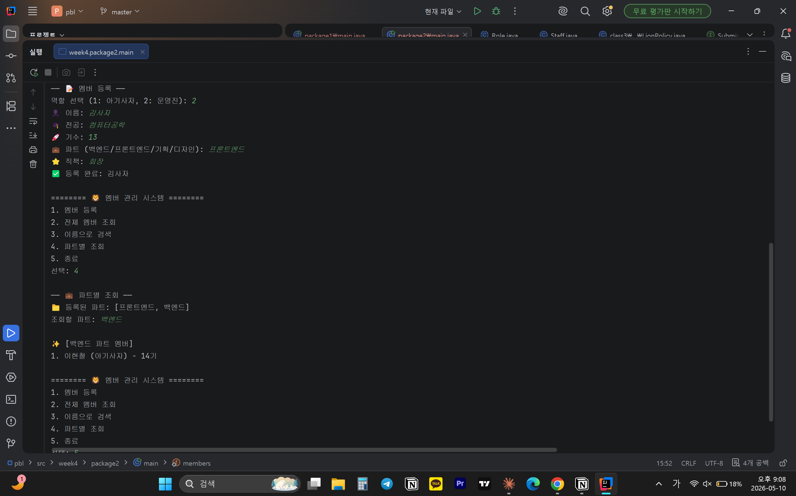

# 📘 Today I Learned

### 1. 오늘 배운 내용
- 리스트와 배열의 차이
- List의 add(), get(), size(), isEmpty() 메서드 사용법
- for-each 문으로 List를 순회하는 방법
- Map의 put(), get(), containsKey(), keySet() 메서드 사용법
- 제네릭(Generic)이 왜 필요한지, List<Role>이 무엇을 의미하는지 설명

### 2. 핵심 정리 (내 언어로)
- 배열은 고정 리스트는 동적
- 제네릭 없으면 → 꺼낼 때 형변환 필요 + 런타임 오류 위험
- 제네릭 있으면 → 타입 안전, 캐스팅 불필요
- List<Role>의 의미 → Role 타입만 넣을 수 있는 List (Lion이나 Staff처럼 Role을 상속한 객체만 저장 가능)

### 3. 결과 이미지(스크린샷)

### 4. 느낀 점
데이터를 목적에 맞는 자료구조로 관리하는 방법을 이해했고 3주차 설계가 어떻게 쓰일 수 있는 지 확인할 수 있었다.
단순 저장은 List 파트별 분류검색은 Map 목적에 맞는 자료구조 선택하는 것이 필요함을 이해할 숭 있었다.