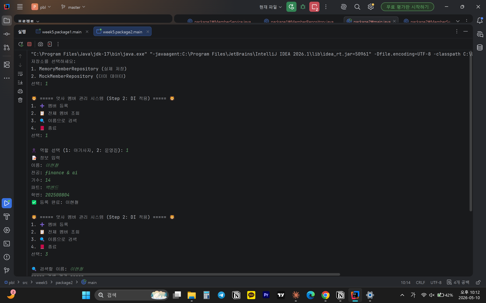
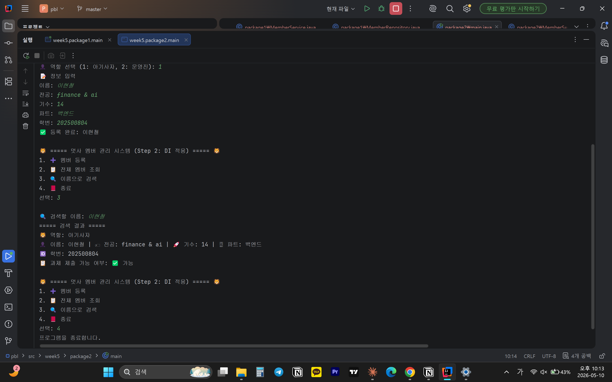

# 📘 Today I Learned

### 1. 오늘 배운 내용
- 강한 결합과 느슨한 결합
- 의존성 주입(DI)
- 제어의 역전(IoC)
- 인터페이스 기반 설계의 유연성
- 생성자를 통해 의존성을 주입하는 방식
- 
### 2. 핵심 정리 (내 언어로)
- 강한 결합 (Step 1) - Service가 구현체를 직접 생성
private MemberRepository repository = new MemberRepository();
→ 구현체 바꾸려면 Service 코드를 직접 수정해야 함
- 느슨한 결합 (Step 2) - 외부에서 주입받음
private final MemberRepository repository; // 인터페이스에만 의존
public MemberService(MemberRepository repository) {
this.repository = repository;
} → Service 코드 건드리지 않고 Main에서만 교체 가능
- 의존성 주입:내가 직접 만들지 않고 외부에서 받아서 쓴다
- 제어의 역전:내가 쓸 객체를 내가 만드는 게 아니라, 누군가 만들어서 넘겨준다
- 인터페이스 기반 설계의 장점: 무엇을 하는지(인터페이스)만 알고 어떻게 하는지(구현체)는 몰라도 된다 → 교체,테스트,유지보수가 쉬워진다

### 3. 결과 이미지(스크린샷)
-
-

### 4. 느낀 점
- Main이 어떤 구현체를 쓸지 결정하고 Service는 로직을 처리하고 Repository는 어떻게 저장할지 실행하는 전반적인 과정을 좀 더 유연하게 이해하게되었다.
- 각 개념들에 대해 더 많은 이해와 복습이 필요할 것 같다.
- 실무에서 어떤 식으로 활용되는 지를 추가적으로 알아보고 공부하면 더 도움될 것 같다.
