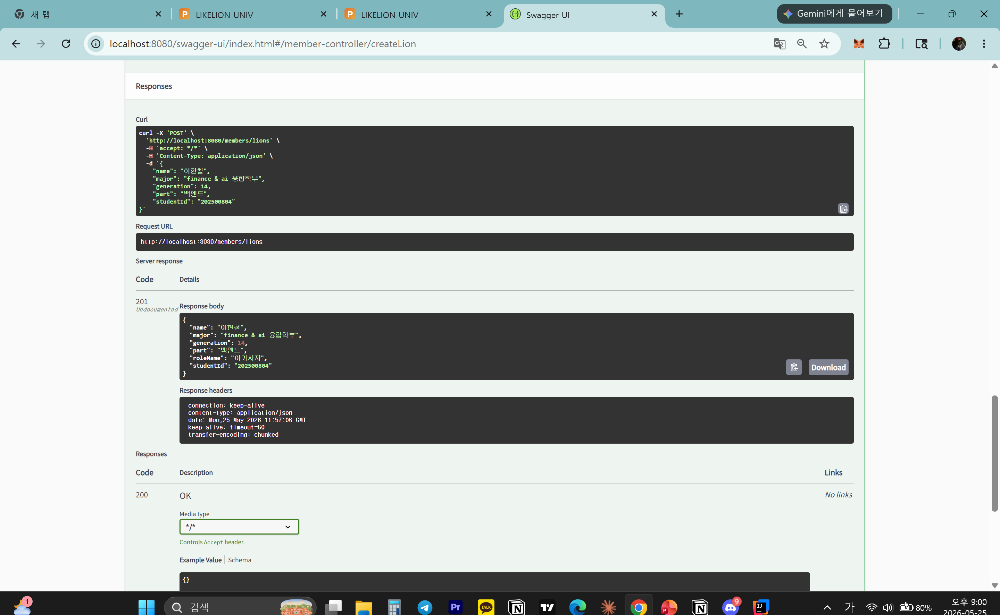
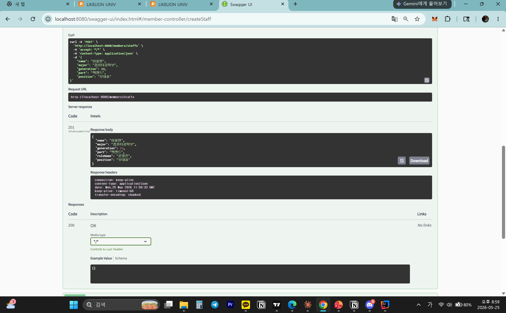
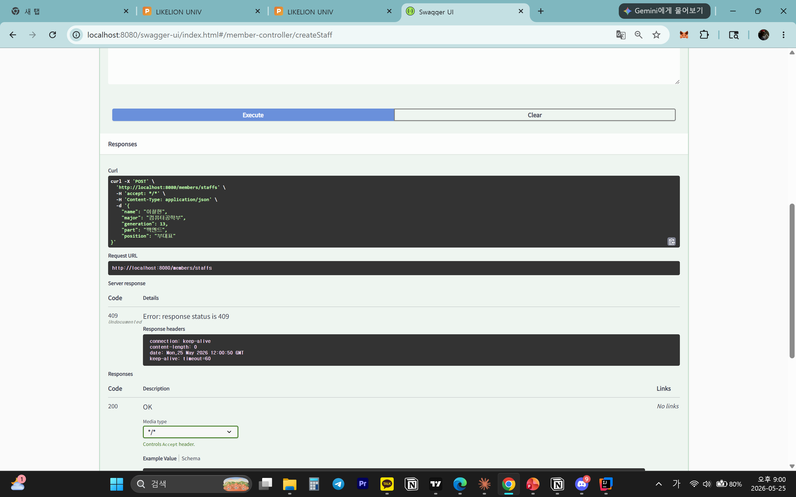
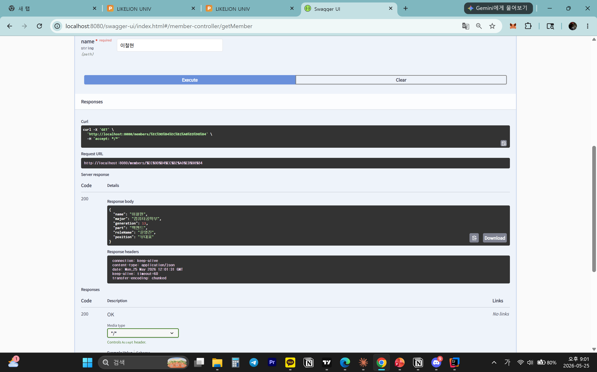
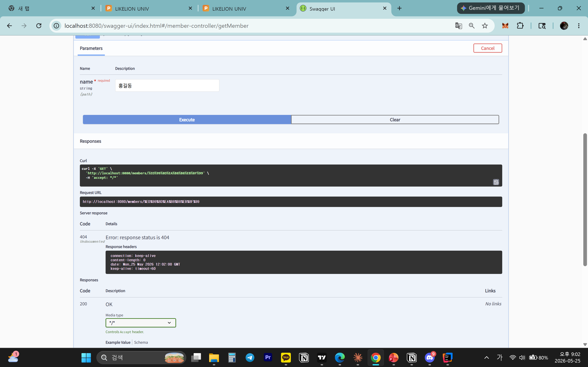
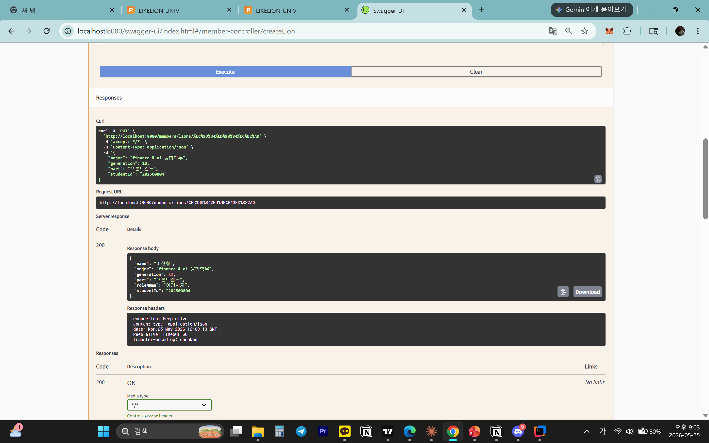
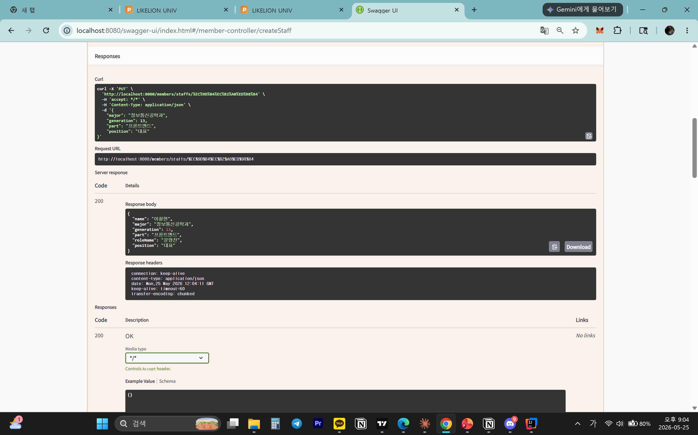
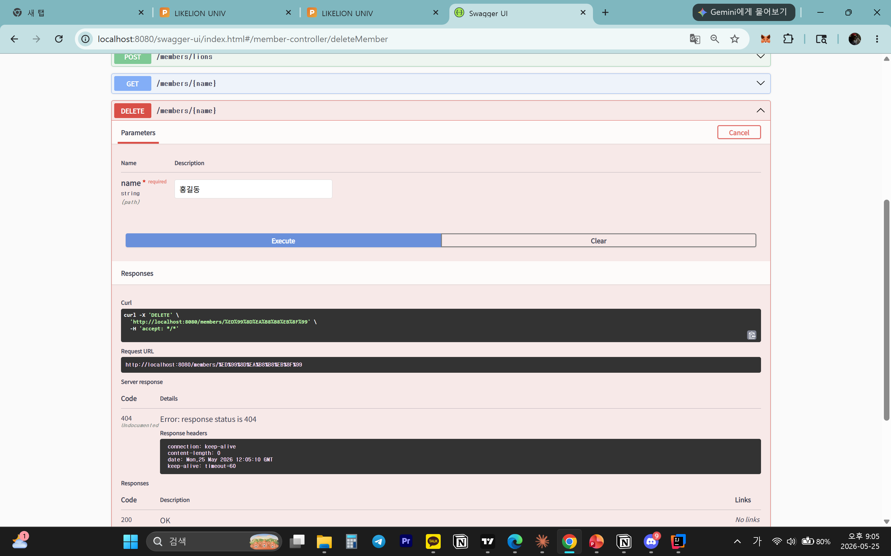

# 📘 Today I Learned

### 1. 오늘 배운 내용
- REST API 설계 원칙 ,HTTP 메서드별 역할 ,HTTP 상태 코드의 의미
- @PathVariable, @RequestBody의 차이
- DTO(Data Transfer Object),역할별로 DTO를 분리하는 이유
- ResponseEntity를 사용해 상태 코드를 제어하는 방법

### 2. 핵심 정리 (내 언어로)
- REST API 설계 원칙
자원의 식별 (URI): 모든 자원은 명사 형태의 고유한 URI로 표현
행위의 표현 (HTTP Method): 자원에 대한 행위는 URI에 담지 않고, HTTP 메서드로 표현
자체 표현 구조 (Self-descriptive): 메시지만 보고도 어떤 요청인지 이해할 수 있어야 함
무상태성 (Stateless): 서버는 클라이언트의 상태를 저장 안해서 각 요청이 독립적이어야 함
- HTTP 메서드별 역할
GET: 자원 조회 (서버 데이터 변경 없음, 캐싱 가능)
POST: 새로운 자원 생성
PUT: 자원의 전체 수정 (없으면 새로 생성)
PATCH: 자원의 일부 수정
DELETE: 자원 삭제
- HTTP 상태 코드의 의미
2xx (Success): 요청 성공 
3xx (Redirection): 요청을 완료하기 위해 클라이언트의 추가 조치 필요 (주소 이동)
4xx (Client Error): 클라이언트 잘못으로 인한 오류 
5xx (Server Error): 서버 내부 문제로 인한 오류 
- @PathVariable vs @RequestBody
@PathVariable: URI 경로에 포함된 변수 값을 추출할 때 사용
@RequestBody: HTTP 요청 Body에 담긴 JSON/XML 데이터를 자바 객체로 변환할 때 사용
- DTO의 역할 및 분리 이유
계층 간(Controller - Service - Repository) 데이터 전송을 위해 사용하는 로직이 없는 순수한 데이터 객체
보안, 유효성 검증 분리
- ResponseEntity는 Spring에서 제공하는 클래스로, HTTP 응답의 Status,Header, Body을 직접 제어할 수 있게 해줌

### 3. 결과 이미지(스크린샷)
- 
- 
- 
- 
- 
- 
- 
- 
- 
### 4. 느낀 점
- REST API 규칙을 준수함으로써 URI와 메서드만으로 기능을 예측할 수 있는 직관적인 소통의 중요성을 느낌.
- Entity와 DTO를 분리하는 이유를 고민하며 변경에 유연하고 보안상 안전한 구조 설계에 대해 깊이 생각해 볼 수 있었음.
- 실무 패러다임과 밀접한 개념들을 학습하니 흥미로웠음. 
