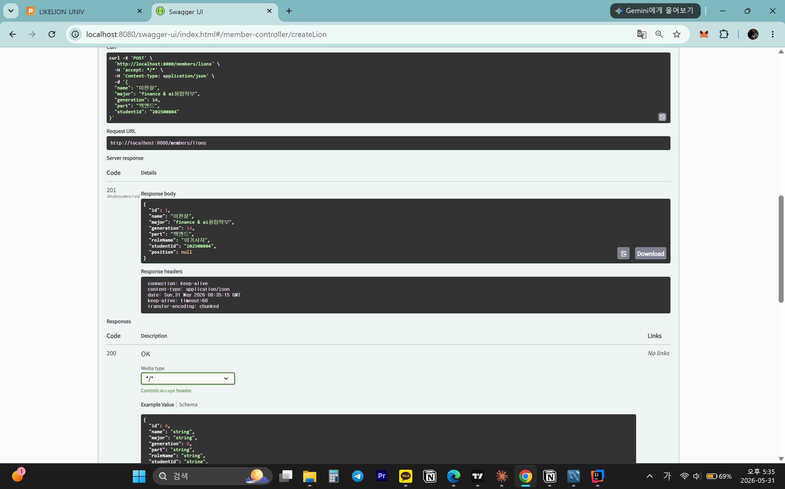
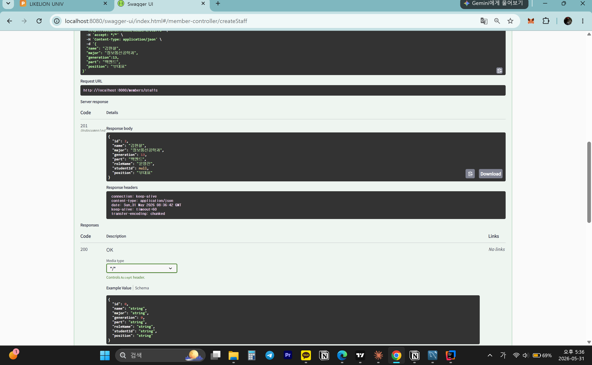
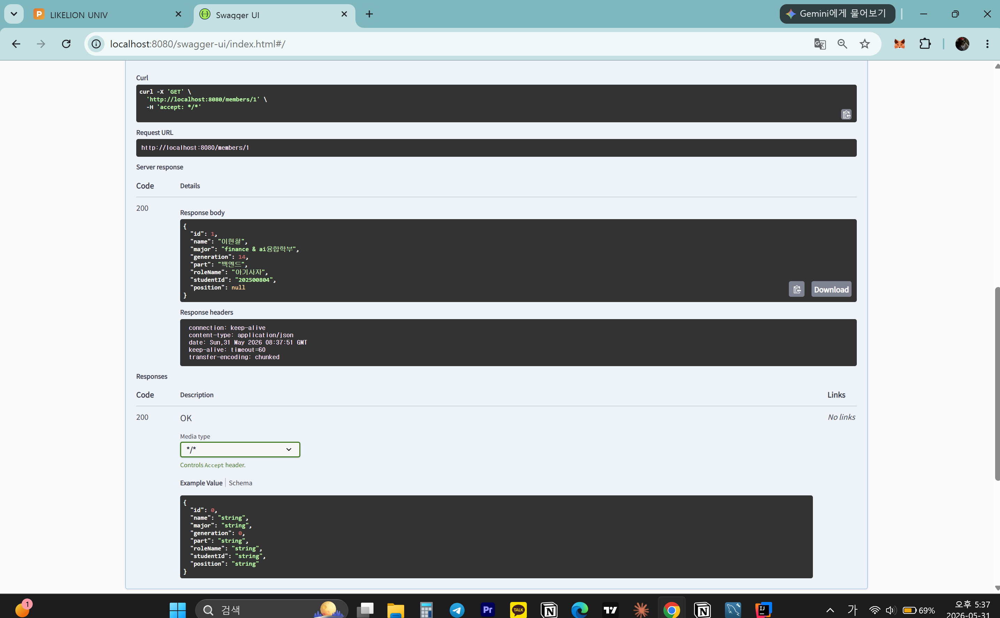
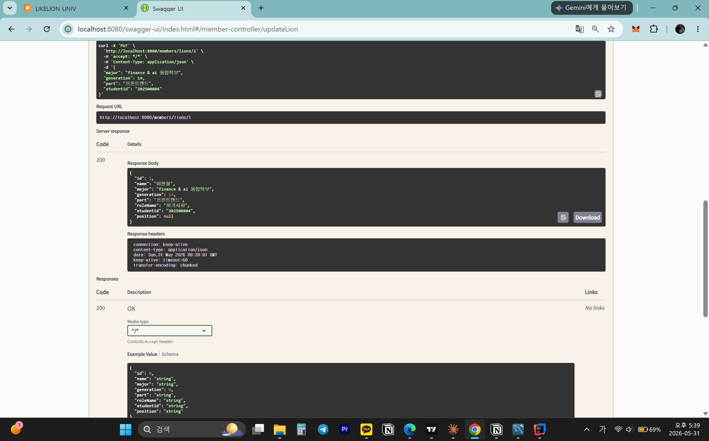
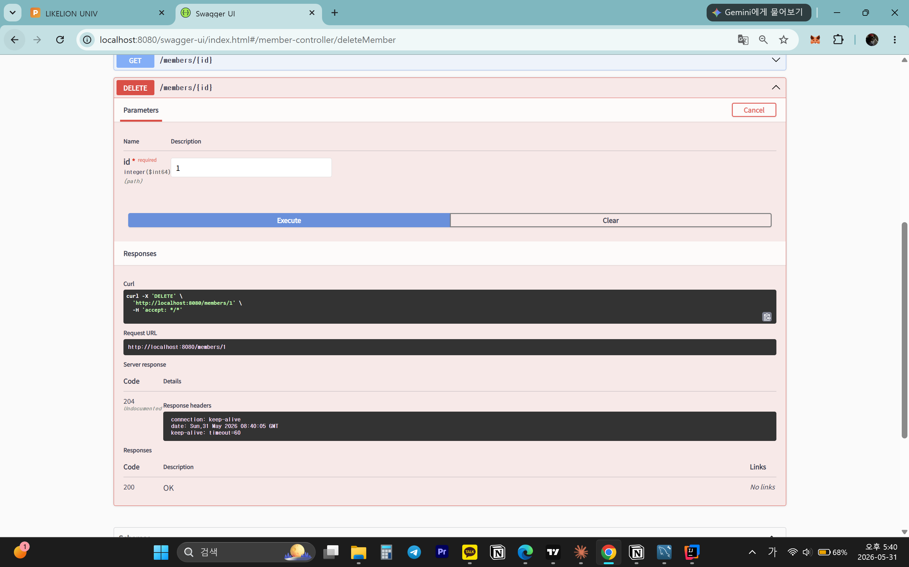
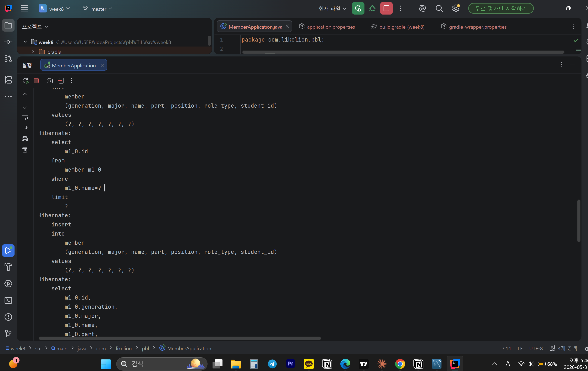
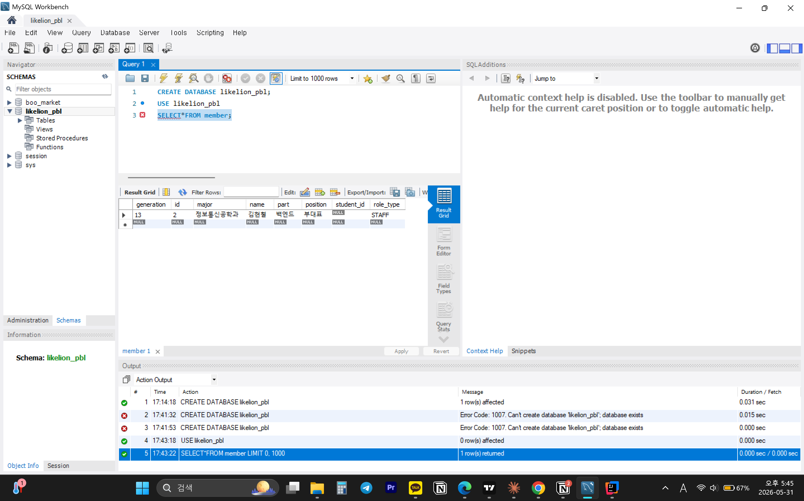

# 📘 Today I Learned

### 1. 오늘 배운 내용
- @Entity와 필요한 이유
- @Id와 @GeneratedValue(strategy = IDENTITY)의 역할
- @Enumerated(EnumType.STRING)의 역할
- JpaRepository를 상속하면 어떤 메서드들이 자동으로 제공되는지
- findByName과 같은 쿼리 메서드 네이밍 규칙
- ddl-auto=create가 하는 것
- 영속성 컨텍스트, save() 호출 시 엔티티에 id가 채워지는 이유
### 2. 핵심 정리 (내 언어로)
- @Entity JPA에게 "이 클래스를 DB 테이블과 매핑해줘"라고 알려주는 어노테이션
- @Id → 이 필드가 기본키(PK)임을 선언
- @GeneratedValue(IDENTITY) → DB가 INSERT 시 자동으로 1, 2, 3... 순서로 id를 부여해줌
- @Enumerated(EnumType.STRING): Enum을 DB에 저장할 때 숫자 대신 문자열로 저장
- JpaRepository가 자동 제공하는 메서드 : save(), findById(), findAll(), deleteById(), existsById()
- 쿼리 메서드 네이밍 규칙: 메서드 이름만으로 SQL이 자동 생성됨. findBy + 필드명으로 조건 쿼리를 만들 수 있음.
- ddl-auto=create: 앱 시작 시 기존 테이블을 DROP하고 새로 CREATE함.
- 영속성 컨텍스트 / save() 후 id가 채워지는 이유
- 영속성 컨텍스트는 JPA가 엔티티를 관리하는 메모리 공간. save() 호출 시 DB에 INSERT가 실행되고, DB가 생성한 id값을 JPA가 받아서 엔티티 객체의 id 필드에 자동으로 채워줌. 그래서 save() 반환값을 쓰면 id가 들어있음.

### 3. 결과 이미지(스크린샷)
- 
- 
- 
- 
- 
- 
- 

### 4. 느낀 점
- week7에서 직접 for문 돌려가며 구현했던 게 JpaRepository 상속 하나로 다 해결되는 점이 효율적이라고 느꼇다
- 메서드 이름만 규칙에 맞게 지으면 SQL이 자동 생성되는 게 신기했다.
- ddl-auto=create 때문에 서버를 재시작하면 데이터를 초기화할 수 있다는 것을 알았다.
 
