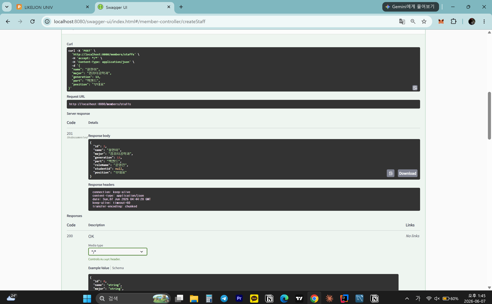
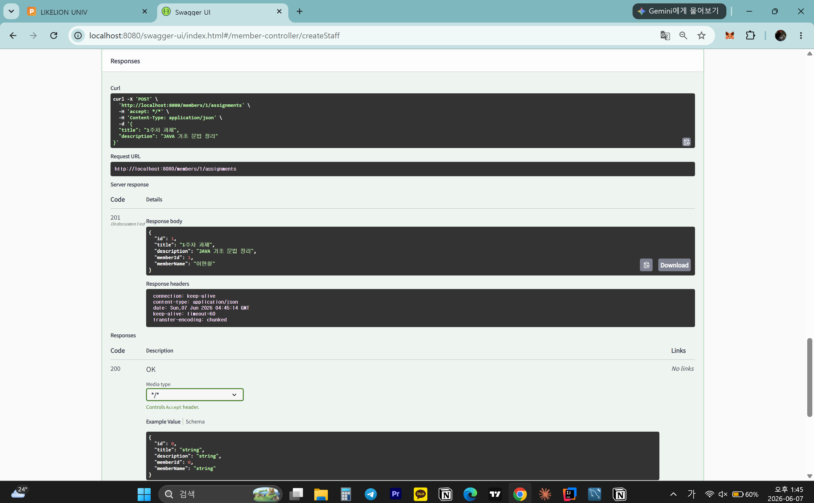
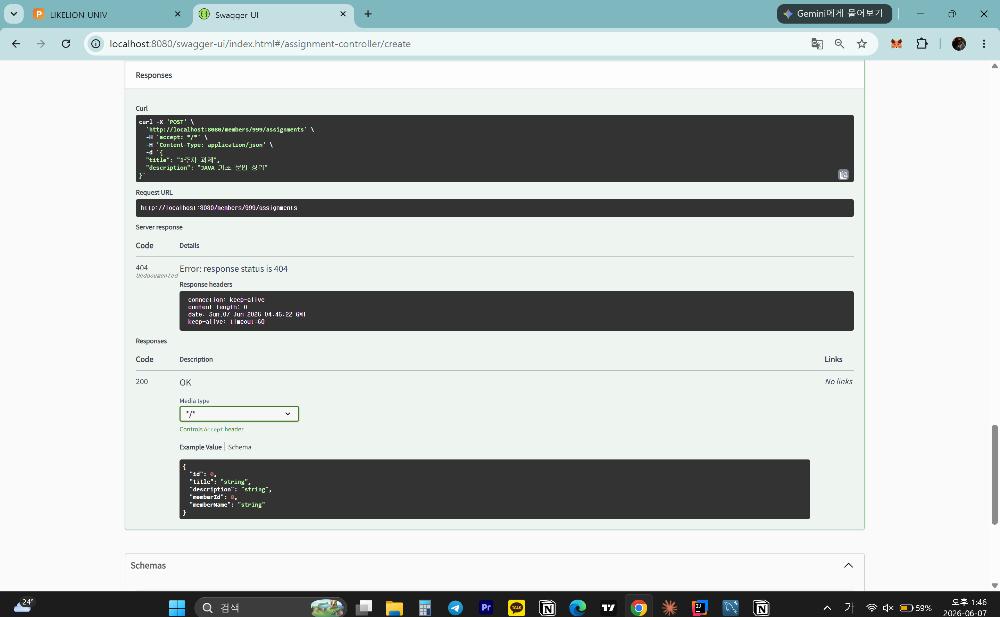
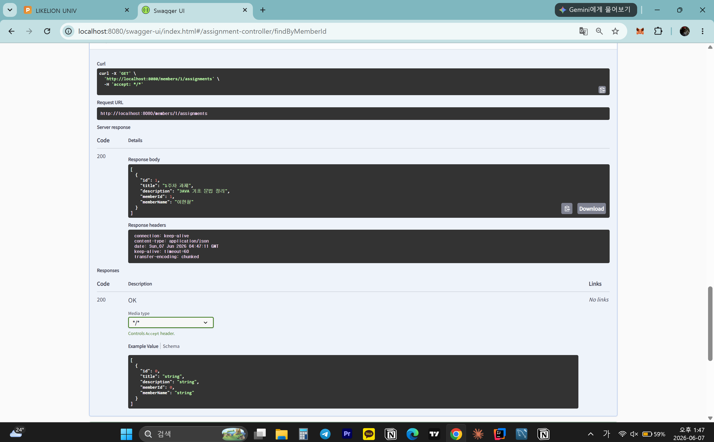
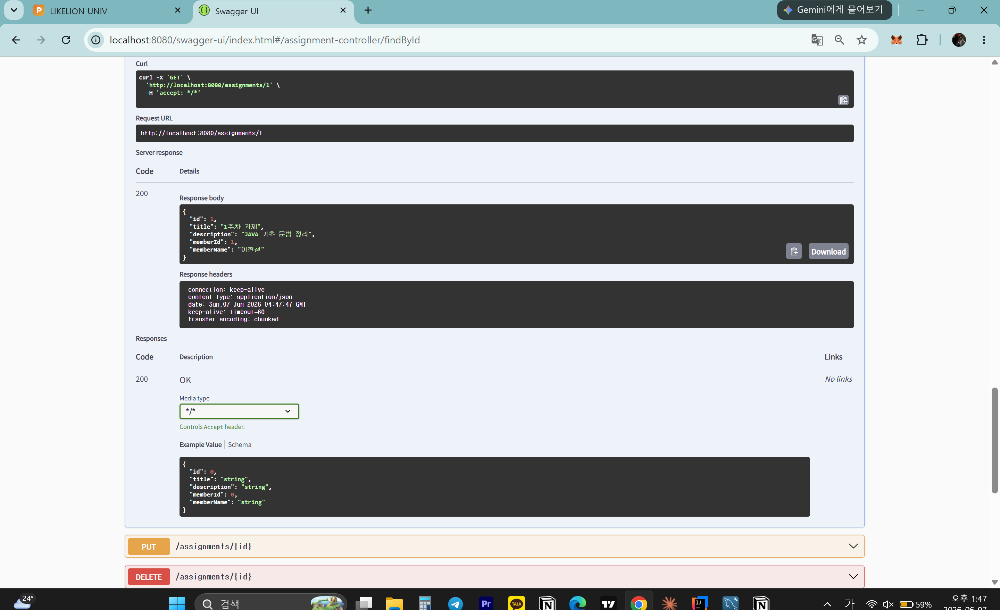
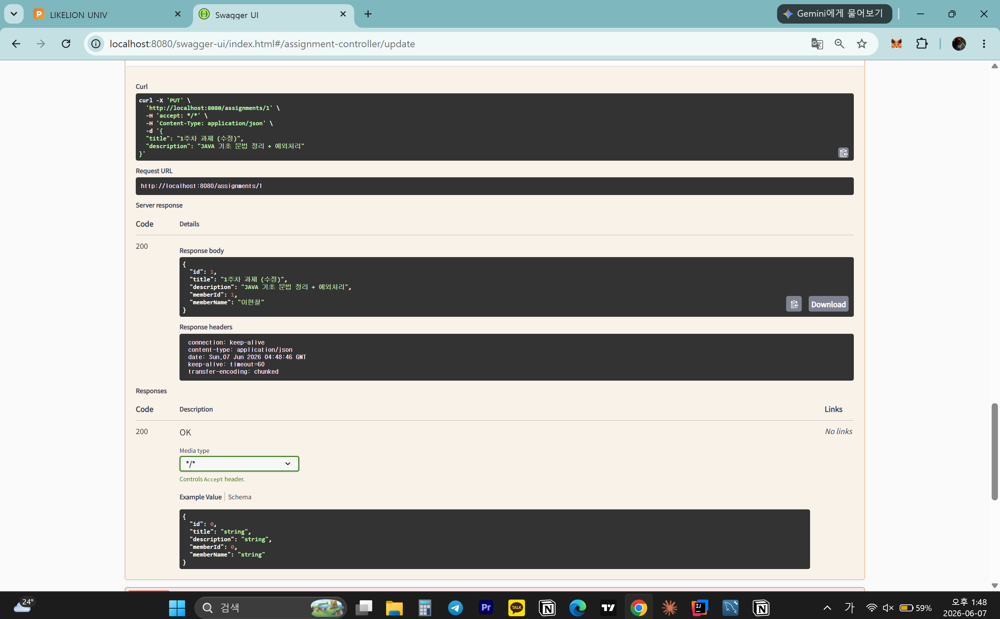
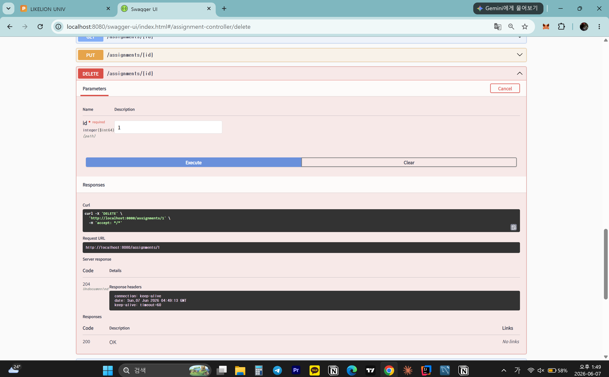
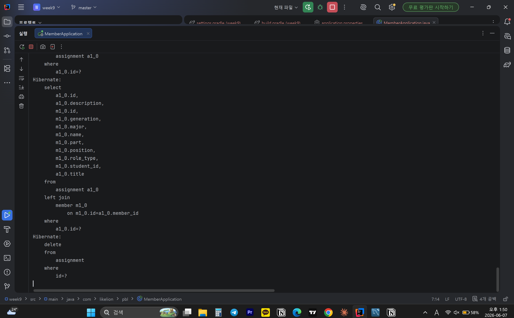
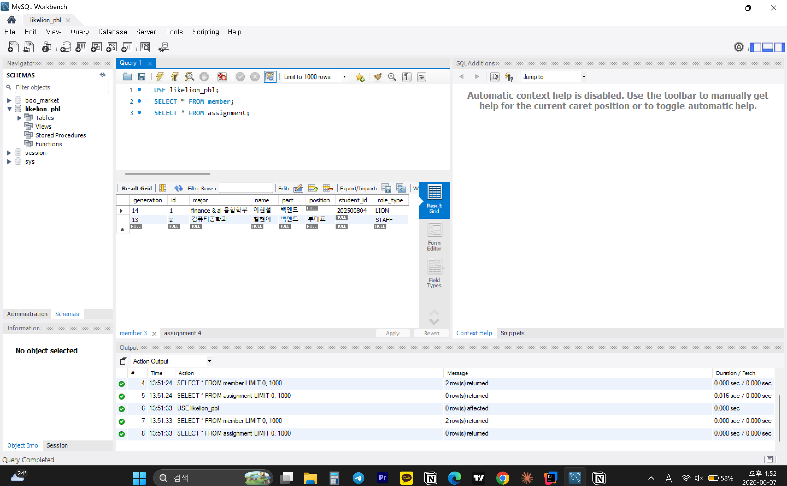

# 📘 Today I Learned

### 1. 오늘 배운 내용
- @ManyToOne과 @OneToMany의 역할과 차이
- 연관관계의 주인(owning side)
- mappedBy의 의미
- @JoinColumn의 역할
- DB의 외래 키(Foreign Key)가 어떤 테이블에 생기는지
- @Transactional이 무엇이고, 서비스 계층에 붙이는 이유
- @Transactional(readOnly = true)를 조회 메서드에 사용하는 이유
### 2. 핵심 정리 (내 언어로)
- @ManyToOne Member(N쪽),@OneToMany Team(1쪽)
- 외래 키(FK)를 실제로 관리하는 쪽 = 연관관계의 주인
- mappedBy:mappedBy가 있는 쪽은 절대 FK를 관리하지 않는다, 여기에 값을 넣어도 DB에 반영되지 않음 
- @JoinColumn: FK 컬럼의 이름과 설정을 지정하는 어노테이션
- 항상 N쪽(주인) 테이블에 FK가 생긴다->관계형 DB에서 "N개의 행이 1개를 참조"하는 구조상, N쪽 테이블 행마다 FK 컬럼을 갖는 것이 자연스럽기 때문.
- @Transactional: 여러 DB 작업을 하나의 논리적 단위로 묶는 것
- 서비스 계층에 붙이는 이유: 하나의 비즈니스 로직 = 하나의 트랜잭션이 되어야 일관성 보장, Repository 계층은 단순 쿼리 단위 → 트랜잭션 경계로 부적합 , Controller는 HTTP 관심사 → 트랜잭션 관심사와 분리
- @Transactional(readOnly = true): 조회 전용임을 선언해 성능을 최적화하는 옵션->Dirty Checking 비활성화,flush 생략,DB 드라이버 최적화
### 3. 결과 이미지(스크린샷)

### 4. 느낀 점
- week8에서는 Member 하나만 다뤘는데, week9에서는 Assignment라는 새로운 엔티티가 생기면서 두 테이블이 연관관계로 묶이는 구조를 처음 다뤄봤다. 
- @ManyToOne과 @OneToMany로 연결하니까 DB에 member_id 외래키 컬럼이 자동으로 생기는 게 신기했다.
- MySQL Workbench에서 직접 눈으로 확인하니까 객체 간의 관계가 DB에 어떻게 반영되는지 체감할 수 있었다. 
- 연관관계의 주인이 Assignment라는 것, 즉 @ManyToOne이 붙은 쪽이 외래키를 관리하고 Member의 @OneToMany는 읽기 전용이라는 개념이 처음엔 헷갈렸다. 
- 하지만 실제로 과제를 등록할 때 memberId로 Member를 먼저 조회하고 없으면 404를 반환하는 흐름을 직접 구현하면서 자연스럽게 이해됐다. 
